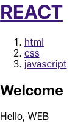
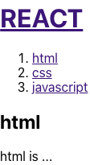
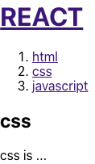

### React
#### 등장배경
- JavaScript를 사용하여 HTML UI를 제어하기 위해선 DOM Selector API를 사용해 특정 DOM을 선택하고 변화를 주어야함
- 처리해야 할 이벤트가 많아지고 DOM 요소도 많아진다면 코드의 유지보수가 어려움
- 리액트는 '상태가 바뀌었을 때 DOM을 업데이트하는 것이 아니라 아예 새롭게 생성한다'라는 아이디어로 개발됨
- 새롭게 생성 -> 속도 문제 발생 -> 가상 돔으로 해결(상태가 업데이트 되면 업데이트가 필요한 곳의 UI를 가상 돔을 통해 렌더링, 실제 DOM과 비교해 차이가 있는 곳을 DOM에 패치)
- API 통신이나 사용자 이벤트를 통해서 프로그램 상태값 변경 -> 리액트가 변경된 상태값을 기반으로 UI를 자동으로 업데이트
- but UI 기능만 제공 -> 전역 상태 관리나 라우팅에는 관여x

#### 추가
- render 함수는 순수 함수(입력값이 동일하면 출력이 같은 함수)로 작성
- state는 불변 변수로 관리 -> 객체 속성 변경 시 새로운 객체를 만들어서 값 할당
=> 렌더링 성능 향상
- 가상 돔(virtual dom) 사용


#### JSX 기본 규칙
- 태그는 꼭 닫혀야 함
- 두 개 이사의 태그가 존재하면 하나의 태그로 감싸야 함
```jsx
function App(){
    return (
        <Hello />
        <div>test</div>
    );
} //에러 발생
```
- Fragment(<> </> 단순히 감싸는 용도) 사용 가능
- JavaScript 값을 사용하기 위해선 {} 사용
- 인라인 스타일의 경우 Camel Style로 작성(여러 단어를 연달아 사용할 때 각 단어의 첫 글자를 대문자로 적되, 맨 앞에 오는 글자는 소문자로 표기하는 것)
- class는 className= 으로 설정
```jsx
function App(){
    const name = 'react';
    const style ={
        backgroundColor: 'black',
        fontSize: 24
    }
    return (
        <>
            <Hello />
            <div style={style}>{name}</div>
            <div className="test"></div>
        </div>
    );
}
```
```css
.test{
    background: gray;
    width: 64px;
}
```

#### props
- 컴포넌트에게 props 파라미터를 통해 값을 넘겨줄 수 있음
```jsx
import React from 'react';
import Hello from './Hello';

function App(){
    return (
        <Hello name="react" />
    );
}
```
```jsx
import React from 'react';

function Hello(props){
    return <div>안녕하세요 {props.name}</div>
}

export default Hello;
```
- props는 객체 형태로 전달됨
- 컴포넌트에 defaultProps를 지정해 기본값을 설정할 수 있음
```jsx
function Nav(props){
    const lis = []
    for(let i=0;i<props.topics.length;i++){
        let t = props.topics[i];
        lis.push(<li key={t.id}><a href={'/>read/'+t.id}>{t.title}</a></li>)
    }
    return <nav>
        <ol>
            {lis}
        </ol>
    </nav>
}
export default Nav;
```
```jsx
function App () {
    const topics = [
        {id:1, title:'html', body:'html is ...'},
        {id:2, title:'css', body:'css is ...'},
        {id:3, title:'javascript', body:'javascript is ...'}
    ]
    return (
        <div>
            <Nav topics={topics} />
        </div>
    )
}
```
- 배열 접근도 가능


#### 이벤트
- props로 함수를 넘겨주고, 해당 컴포넌트에서 함수를 활용할 수 있음
```jsx
function App () {
    return (
        <div>
            <Header title="REACT" onChangeMode={()=>{
                alert('Header');
            }}/>
        </div>
    )
}
```
```jsx
function Header(props){
    return<header>
        <h1><a href="/" onClick={(event)=>{
            event.preventDefault(); // a태그를 클릭해도 href 링크로 이동하지 않음
            props.onChangeMode(); // 전달 받은 함수 실행
        }}>{props.title}</a></h1>
    </header>
}

export default Header;
```
- 각 props 정보를 활용할 수 있음
```jsx
function App () {
    const topics = [
        {id:1, title:'html', body:'html is ...'},
        {id:2, title:'css', body:'css is ...'},
        {id:3, title:'javascript', body:'javascript is ...'}
    ]
    return (
        <div>
            <Header title="REACT" onChangeMode={()=>{
                alert('Header');
            }}/>
            <Nav topics={topics} onChangeMode={id=>{
                alert(id);
            }}/>
        </div>
    )
}
```
```jsx
function Nav(props){
    const lis = []
    for(let i=0;i<props.topics.length;i++){
        let t = props.topics[i];
        lis.push(<li key={t.id}>
            <a id={t.id} href={'/>read/'+t.id} onClick={event=>{
                event.preventDefault();
                props.onChangeMode(event.target.id);
            }}>{t.title}</a>
        </li>)
    }
    return <nav>
        <ol>
            {lis}
        </ol>
    </nav>
}
export default Nav;
```


#### state
- props | state 변경 -> 컴포넌트 함수 처리 -> 리턴(새로운 UI)
- props은 컴포넌트를 사용하는 외부자를 위함
- state는 컴포넌트를 만드는 내부자를 위함
```js
import React, { useState } from 'react';
import Header from './component/Header'
import Nav from './component/Nav';
import Article from './component/Article';

function App () {
    const [mode, setMode] = useState('WELCOME');
    const topics = [
        {id:1, title:'html', body:'html is ...'},
        {id:2, title:'css', body:'css is ...'},
        {id:3, title:'javascript', body:'javascript is ...'}
    ]
    let content = null;
    if(mode === 'WELCOME'){
        content = <Article title="Welcome" body="Hello, WEB"></Article>
    }
    else if(mode === 'READ'){
        content = <Article title="Read" body="Hello, Read"></Article>
    }
    return (
        <div>
            <Header title="REACT" onChangeMode={()=>{
                setMode('WELCOME');
            }}/>
            <Nav topics={topics} onChangeMode={id=>{
                setMode('READ');
            }}/>
            {content}
        </div>
    )
}

export default App;
```





#### Create 예시
```jsx
function Create(props){
    return <article>
        <h2>Create</h2>
        <form onSubmit={event=>{
            event.preventDefault(); // 페이지 리로드 막기
            const title = event.target.title.value; // event.target은 이벤트가 발생한 form의미
            const body = event.target.body.value;
            props.onCreate(title, body);
        }}>
            <p><input type="text" name="title" placeholder="title"/></p>
            <p><textarea name="body" placeholder="body"/></p>
            <p><input type="submit" value="Create"></input></p>
        </form>
    </article>
}

export default Create;
```
```jsx
import React, { useState } from 'react';
import Header from './component/Header'
import Nav from './component/Nav';
import Article from './component/Article';
import Create from './component/Create';

function App () {
    const [mode, setMode] = useState('WELCOME');
    const [id, setId] = useState(null);
    const [nextId, setNextId] = useState(4);
    const [topics,setTopics] = useState([
        {id:1, title:'html', body:'html is ...'},
        {id:2, title:'css', body:'css is ...'},
        {id:3, title:'javascript', body:'javascript is ...'}
    ]);
    let content = null;
    if(mode === 'WELCOME'){
        content = <Article title="Welcome" body="Hello, WEB"></Article>
    }
    else if(mode === 'READ'){
        let title, body = null;
        for(let i=0;i<topics.length;i++){
            if(topics[i].id === id){
                title = topics[i].title;
                body = topics[i].body;
            }
        }
        content = <Article title={title} body={body}></Article>
    }
    else if(mode === 'CREATE'){
        content = <Create onCreate={(_title, _body)=>{
            const newTopic = {id:nextId, title:_title, body:_body}
            const newTopics = [...topics]
            newTopics.push(newTopic);
            setTopics(newTopics);
            setMode('READ');
            setId(nextId);
            setNextId(nextId+1);
            //기존 값과 새로운 값을 비교 -> 다르다면 컴포넌트 렌더링
        }}/>
    }
    return (
        <div>
            <Header title="REACT" onChangeMode={()=>{ß
                setMode('WELCOME');
            }}/>
            <Nav topics={topics} onChangeMode={_id=>{
                setMode('READ');
                setId(_id);
            }}/>
            {content}
            <a href="/create" onClick={event=>{
                event.preventDefault();
                setMode('CREATE');
            }}>Create</a>
        </div>
    )
}

export default App;
```


#### 조건부 렌더링
```jsx
import React from 'react';
import Hello from './Hello';

function App(){
    return (
        <>
            <Hello name="react" color="red" isSpecial={true}/>
        </>
    )
}
```
```jsx
import React from 'react';

function Hello({color, name, isSpecial}){
    return (
        <div style={{ color }}>
        { isSpecial ? <b>*</b> : null }
        {/* {isSpecial && <b>*</b>} 가능 */}
        안녕하세요 { name }
        </div>
    );
}

export default Hello;
```
- 빨간 글씨로 '*안녕하세요 react' 출력


#### import 중괄호 {} 의미
- export 방식의 차이
- default로 export한 경우 괄호를 사용하지 않아도 import할 수 있음 + 변수명도 마음대로 사용 가능
- 나머지의 경우 export할 때 변수명을 그대로 사용해야하고 괄호 안에서 호출해야함
- as 키워드를 사용해 변경 가능
```jsx
const a = 1;
const b = 2;
export { a };
export const c = 3;
export default b;
// default가 여러개 -> 처음 정의한 부분 사용
```
```jsx
import d, { a, c as e} from './example';
// 변수 d가 b를 import한 것
```


<!-- 카운터 & useState -->
React Hook

    1. Class를 이용한 코드 작성 필요 없이, state & 기능들 사용할 수 있도록 만든 라이브러리
    2. 함수 컴포넌트를 클래스 컴포넌트처럼 사용 가능
    3. useSate, useContext, useReducer ...
    4. 함수 컴포넌트에서 React state & 생명주기 기능을 연동할 수 있게 해줌
1. UseState
    1. Const [state, state변경함수] = useState(기본 state값)
    2. 새로운 객체를 만들어서 객체에 변화를 줘야함(react의 불변성 때문에 input[name]=value로 직접 접근해도 리렌더링 되지 않음
2. useContext
    1. props를 글로벌하게 사용할 수 있게 도와줌
    2. 부모 & 자식 관계보다 복잡한 관계 -> context를 통해 조금 쉽게 사용가능
    3. 단일 export할 수 있는 변수 생성 & ContextProvider 생성
3. useEffect
    1. 리액트 컴포넌트가 랜더링 될 때마다 특ㄲ정 작업 실행
    2. 컴포넌트가 mount 됐을 때, unmount 됐을 때, update 됐을 때 작업 처리
    3. useEffect(function, deps) -> 수행하고자 하는 작업, 검사하고자 하는 특정 값 | 빈 배열
    4. componentDidMount + componentDidUpdate를 합친 형태
4. useHistory
    1. 
5. useRef
    1. 


React 관련


1. Super & props
    1. super 선언 전까지 construct 안에 this 키워드 사용 불가능
2. Axios
    1. 브라우저, NodeJS를 위한 HTTP 비동기 통신 라이브러리
    2. Get / Post 반환값은 Promise 객체
3. JSX에서는 {test.length>0 && <h1> asdf </h1>} 방식으로 조건부로 넣기 가능
4. ComponentDidMount는 DOM에 렌더링 된 후에 작동
5. this.state.asdf = ~~ 는 constructor에서 밖에 사용 불가능, setState사용 필요
6. NavLink to / path / query 
7. Concurrent -> 사용자의 입력을 보여주는 것이 우선순위가 더 높다고 판단 & 렌더링 인터럽트
8. let vs var
    1. var은 똑같이 var A = x; var A = y; 해도 에러 X
    2. let은 에러 발생
    3. var과 달리 let은 선언문 이전에 사용하면 에러 발생(호이스팅 문제 - var 선언문이나 function 선언문을 스코프의 선두로 옮긴 것처럼 동작하는 특성)
9. 리액트 기초
    1. class ~ extends React.Component 생성
    2. render() 메소드 & this.props 사용 가능
    3. constructor(props) & super를 통해 초기 this.state 지정 가능
10. Reducer
    1. 현재 상태와 액션 객체를 파라미터로 받아서 새로운 상태를 반환해주는 함수
    2. Const [state, dispatch] = useReducer(reducer, initialState)
    3. State는 컴포넌트에서 사용할 수 있는 상태, Dispatch는 액션을 발생시키는 함수
11. Redux
    1. 언제 어디서든 원하는 state 사용하기 위함
    2. 외부에 store를 두고 관리
12. 컨테이너 컴포넌트
    1. 내부에 DOM 엘리먼트가 직접적으로 사용 X
    2. 리덕스에 직접 접근 가능
13. 프레젠테이셔널 컴포넌트
    1. 뷰만 담당하는 컴포넌트
    2. DOM 엘리먼트, 스타일 가지고 있음
    3. 리덕스 스토어 접근 권한 X, props로만 데이터 가지고 올 수 있음
    4. 대부분 State를 가지고 있지 않음 / UI에 관련된 경우 가능
14. Bind
    1. this를 수정하게 해주는 내장 메소드 
    2. 함수처럼 호출 가능한 ‘특수 객체’ 반환 / this가 고정된 func 호출과 동일
15. Axios
    1. Fetch API -> body 프로퍼티 사용 & url이 함수 인자로 사용됨
    2. Axios -> data 프로퍼티 사용 & url이 option 객체로 사용됨
    3. HTTP 통신 요구사항을 컴팩트한 패키지로써 사용 가능
    4. 브라우저 <-> NodeJS를 위한 Promise API 활용 HTTP 비동기 통신 라이브러리
        1. GET : 데이터를 받아옴, 데이터를 가져와서 보여줌(값이나 상태 변화 X)
        2. POST : 새로운 리소스 생성 / 파일 업로드 (주소창에 쿼리스트링 남지 않음 -> GET보다 안전)
16. npm vs npx
    1. npx는 nodeJS 패키지를 실행시키는 도구
    2. 실행 과정에서 로컬에 저장되어 있는 경우 실행 / 존재하지 않는다면 npx가 가장 최신 버전을 설치하고 실행
17. Recoil
    1. 등장배경
        1. 컴포넌트의 상태는 공통된 상위요소까지 끌어올려야 공유 가능 & 이 과정에서 트리가 다시 렌더링 되어야함
        2. Context는 단일 값만 저장 가능
    2. 장점
        1. 공유상태도 React의 내부상태처럼 get/set 인터페이스로 사용 가능(boilerplate-free API)
    3. 주요개념
        1. Atoms
            1. 상태의 단위 / 업데이트 & 구독 가능

  

// 7 useState
// youtube update , delete

*****
#### 참고
https://ko.reactjs.org/<br>
https://www.youtube.com/playlist?list=PLuHgQVnccGMCOGstdDZvH41x0Vtvwyxu7<br>
https://react.vlpt.us/<br>
https://codingmania.tistory.com/333<br>